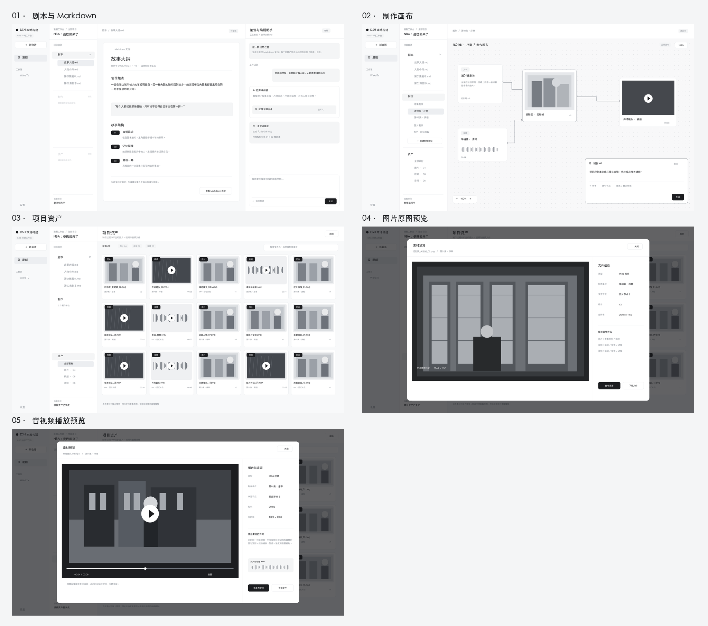

# 项目工作台分阶段布局设计

## 设计范围

进入项目后，应用外层保留现有 DSH 全局侧栏。剧本阶段使用左侧目录、中间文档、右侧 AI 协作三栏；制作和资产阶段去掉右侧固定 AI 栏，让画布或媒体宫格占据剩余宽度。五张 2048 × 1152 的黑白设计图用于先确认信息架构与交互，不代表已实现的页面或真实生成结果。

## 设计图

| 状态 | 设计图 | 主要决定 |
| --- | --- | --- |
| 剧本创作 | [01 剧本与 Markdown 浏览](designs/project-workspace-v2/01-script.png) | 左侧生成产物形成文件树，中间浏览 Markdown，右侧 AI 生成剧本。制作与资产尚不可用。 |
| 制作进行中 | [02 制作单位与无限画布](designs/project-workspace-v2/02-production-canvas.png) | 逐集或整片制作；画布横向展开，右下角只保留悬浮 AI 创作框。 |
| 资产已生成 | [03 项目资产宫格](designs/project-workspace-v2/03-assets-grid.png) | 媒体宫格横向展开，按类型与制作单位归档和筛选。 |
| 图片打开 | [04 原图预览弹窗](designs/project-workspace-v2/04-asset-preview.png) | 原图放大、缩放、下载及来源信息。 |
| 音视频打开 | [05 播放预览弹窗](designs/project-workspace-v2/05-media-playback.png) | 视频播放进度、音量、全屏；音频在相同弹窗显示波形与播放控制。 |

设计图可由[渲染源文件](designs/project-workspace-v2/render.py)重新生成，图中示例数据与媒体画面仅用于说明布局和状态。

## 按阶段切换的区域

左栏宽约 295 px，只放当前项目的目录和制作单位。“项目目录”标题不设置通用加号；制作单位通过制作分组里的明确入口新建。剧本目录收纳故事大纲、人物小传、单集剧本等 Markdown 文件；剧本页右侧 AI 的结果写入对应目录，用户在中栏阅读、编辑和确认。制作菜单在剧本未完成并确认前置灰；解锁后可按单集建制作单位，也可用整片模板制作 MV 或短视频。项目资产菜单在媒体能力不可用时置灰；能力可用但暂无文件时显示空状态。

中栏在剧本阶段以文档浏览为主；剧本页保留右侧 AI 栏生成 Markdown。制作阶段由无限画布占据原中栏和右栏，每个制作单位有自己的画布，节点分别指向剧本段落、图片、视频和音频；来源和版本始终可追溯。制作 AI 输入框悬浮在画布右下角，只控制当前画布或选中节点，不另设固定 AI 栏。

项目资产宫格占据原中栏和右栏，展示媒体缩略图，卡片保留文件类型、来源单位和版本或时长；页面没有固定 AI 栏。点击卡片进入同一个预览弹窗：图片可放大查看原图；视频和音频可播放、暂停、拖动进度并调节音量。弹窗右侧保留文件信息、来源节点定位与下载入口，属于预览弹窗内容。

## 阶段状态

剧本未完成时，左栏“制作”及其子项不可点击。剧本经用户确认后才能创建制作单位；模板选择“逐集”或“整片”不会自动产生正式媒体。资产入口取决于项目是否接入可用的媒体能力；有能力但产物为空时展示空列表，而非误显示已有资产。设计图中的示例片段、人物、数量与文件名均为展示数据。
